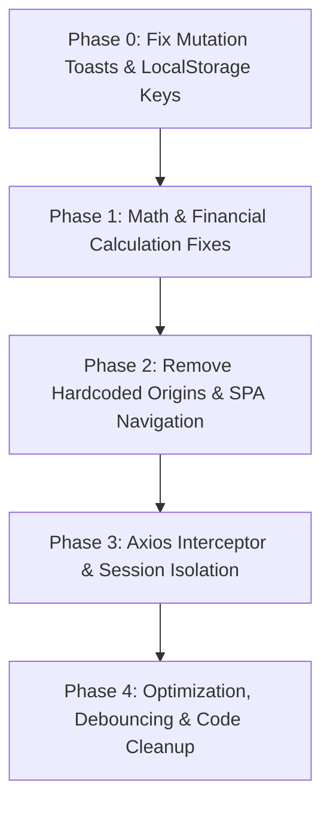

# 🔍 Catering Frontend — Complete Technical Error, Security & Architecture Audit

> **Summary**: Consolidated 40-item technical audit identifying critical runtime crashes, mutation error concealment, authentication state desynchronization, financial calculation bugs, memory leaks, and React anti-patterns in the frontend codebase.

---

## 📊 Findings Overview by Priority

| Priority | Count | Risk Level | Target Action |
| :--- | :---: | :--- | :--- |
| 🔴 **P0** | **12** | Critical (Runtime Crash / False Success Toasts / Financial & State Bugs) | Remediate immediately in Phase 0–1 |
| 🟠 **P1** | **17** | High (Hardcoded Dev Origins / SPA Navigation Bypass / Unhandled Exceptions) | Remediate in Phase 1–2 |
| 🟡 **P2** | **11** | Medium (Memory Leaks / Cache Collisions / Code Quality & Typos) | Remediate in Phase 3–4 |
| **Total** | **40** | **Comprehensive Frontend Codebase Audit** | Full Remediation Roadmap |

---

## 🚀 Most Urgent Remediation Sequence

1. 🟢 **Fix Mutation Success Toasts (#1)**: Move `toast.success()` from `onSettled` to `onSuccess` across all 170+ mutation hooks to prevent false success indicators on server errors.
2. 🔑 **Fix LocalStorage Token Key Desync & Startup Crash (#2, #3)**: Wrap `JSON.parse` in `try...catch` and align token key string `'token'` across `AuthContext`, `AppLayout`, and `queryKeys.ts`.
3. 💰 **Fix Inverted `sum` & Quotation Calculation Bugs (#21, #24)**: Fix `sum` utility subtracting numbers, and repair `cgst` variable name mismatch in quotation grand totals.
4. 🌐 **Eliminate Hardcoded Dev Hostnames (#8)**: Replace `http://localhost:5173` in vendor tender links with `window.location.origin` or `import.meta.env.VITE_APP_URL`.
5. 🛡️ **Fix Response Interceptor Contract & Stale Token Singleton (#4, #5)**: Align Axios interceptor return types and dynamic request authorization headers.
6. 🔄 **Fix Failed Refresh Token Infinite Lock (#6)**: Force redirect to `/signin` when token refresh fails instead of leaving app in broken unauthenticated state.
7. 🚀 **Replace `window.location` Reloads with SPA Routing (#9, #10)**: Replace `window.location.href` and `window.location.reload()` with TanStack Router navigation and query cache invalidations.
8. 🎨 **Fix Dark Mode Root Target (#26)**: Target `document.documentElement` (`<html>`) instead of `document.body` for Tailwind CSS `.dark` class toggles.

---

## 🔴 Category 1: Critical Runtime Crashes & Mutation Concealment Bugs

### - [ ] #1 — Success Toasts Triggering on Mutation Failures (`onSettled` Misuse)
- **Severity**: 🔴 `P0 - Critical UX & Error Concealment`
- **Location**: [src/lib/react-query/queriesAndMutations/cateror/event.ts](file:///c:/Users/LENOVO/OneDrive/Documents/MY%20WORK/phygital/siddhraj/frontend/src/lib/react-query/queriesAndMutations/cateror/event.ts#L54-L59) (and across 170+ mutation files)
- **Detailed Description**: `useMutation` hooks use `onSettled` to trigger success toasts (`toast.success('Event created successfully!')`). `onSettled` executes on **both success and failure**, causing green success toasts to pop up even when the server returns a 500 error.
- **Recommended Fix**: Move `toast.success()` into `onSuccess` and handle errors in `onError`.
- **Verification**: Trigger a server 500 error on event creation and verify error toast appears instead of success.

---

### - [ ] #2 — Uncaught `JSON.parse` Crash on Malformed LocalStorage Tokens
- **Severity**: 🔴 `P0 - Critical Startup Crash`
- **Location**: [src/context/AuthContextProvider.tsx](file:///c:/Users/LENOVO/OneDrive/Documents/MY%20WORK/phygital/siddhraj/frontend/src/context/AuthContextProvider.tsx#L15-L17)
- **Detailed Description**: `JSON.parse(localStorage.getItem(QUERY_KEYS.TOKEN) || 'null')` is invoked directly without a `try...catch` block. If `localStorage` contains invalid JSON or `undefined`, the entire React render tree throws an uncaught `SyntaxError` on boot.
- **Recommended Fix**: Wrap `JSON.parse` in a safe parser function with `try...catch` returning `null` on error.
- **Verification**: Set `localStorage.setItem('token', 'invalid_json')` and confirm app loads safely without crashing.

---

### - [ ] #3 — Mismatched LocalStorage Token Keys between `AppLayout` and `AuthContext`
- **Severity**: 🔴 `P0 - Critical Auth Desync`
- **Location**: [src/layouts/AppLayout.tsx](file:///c:/Users/LENOVO/OneDrive/Documents/MY%20WORK/phygital/siddhraj/frontend/src/layouts/AppLayout.tsx#L15) vs [src/lib/react-query/queryKeys.ts](file:///c:/Users/LENOVO/OneDrive/Documents/MY%20WORK/phygital/siddhraj/frontend/src/lib/react-query/queryKeys.ts#L6)
- **Detailed Description**: `AppLayout` checks `localStorage.getItem('token')` using literal `'token'`, whereas `queryKeys.ts` defines `QUERY_KEYS.TOKEN = 'token'`, and `ADMIN_CATEROR_QUERY_KEYS.TOKEN` uses `'authToken'`. Mismatched keys leave layouts and auth context out of sync.
- **Recommended Fix**: Standardize on `QUERY_KEYS.TOKEN` across all components and layouts.
- **Verification**: Assert login state propagates consistently to `AppLayout`.

---

### - [ ] #4 — Response Interceptor Contract Breakdown (Unwrapping `res.data`)
- **Severity**: 🔴 `P0 - Critical Type Mismatch`
- **Location**: [src/utils/axios.ts](file:///c:/Users/LENOVO/OneDrive/Documents/MY%20WORK/phygital/siddhraj/frontend/src/utils/axios.ts#L63-L66)
- **Detailed Description**: The Axios response interceptor unwraps responses (`return res.data;`), while API function types expect `AxiosResponse<T>`. When API calls try to read `response.data.data`, runtime `TypeError: Cannot read properties of undefined` crashes occur.
- **Recommended Fix**: Align interceptor return types with explicit TypeScript declarations across all API service functions.
- **Verification**: Perform TypeScript compile check (`npx tsc --noEmit`) and verify API response access.

---

### - [ ] #5 — Stale Axios Authorization Singleton Instance
- **Severity**: 🔴 `P0 - Critical Session Flaw`
- **Location**: [src/utils/axios.ts](file:///c:/Users/LENOVO/OneDrive/Documents/MY%20WORK/phygital/siddhraj/frontend/src/utils/axios.ts#L11-L19)
- **Detailed Description**: `token` is loaded once when `axios.ts` is imported (`let token = JSON.parse(...)`). When a user logs in dynamically, `api` headers retain the pre-login `null` token state until a request interceptor fallback runs.
- **Recommended Fix**: Retrieve token dynamically inside request interceptors using a single source of truth function `getStoredToken()`.
- **Verification**: Complete login flow and verify initial API request includes valid `Bearer` header.

---

### - [ ] #6 — Failed Refresh Token Silent Failure Lock
- **Severity**: 🔴 `P0 - Critical Session Lock`
- **Location**: [src/utils/axios.ts](file:///c:/Users/LENOVO/OneDrive/Documents/MY%20WORK/phygital/siddhraj/frontend/src/utils/axios.ts#L53-L57)
- **Detailed Description**: When token refresh fails, the catch block removes `QUERY_KEYS.TOKEN` from `localStorage`, but fails to redirect the user to `/signin` or dispatch a logout event. The app enters a dead state where subsequent actions fail silently.
- **Recommended Fix**: Trigger `window.location.href = '/signin'` or an auth-logout event inside the refresh failure handler.
- **Verification**: Expire refresh token and verify immediate redirect to login page.

---

### - [ ] #7 — Missing Dynamic Expiration Handling in Auth Context
- **Severity**: 🔴 `P0 - Critical Auth Expiration`
- **Location**: [src/context/AuthContextProvider.tsx](file:///c:/Users/LENOVO/OneDrive/Documents/MY%20WORK/phygital/siddhraj/frontend/src/context/AuthContextProvider.tsx#L14-L37)
- **Detailed Description**: JWT expiration is verified only once inside `useEffect([], ...)`. If a user's token expires while active on a page, `AuthContext` state remains `isAuthenticated: true`.
- **Recommended Fix**: Implement periodic token expiration checks or listen to 401 response events emitted by Axios.
- **Verification**: Simulate token expiry during active session and verify state updates to unauthenticated.

---

## 💰 Category 2: Logic, Financial & Calculation Flaws

### - [ ] #21 — Deceptive `sum` Utility Function Subtracting Instead of Adding
- **Severity**: 🔴 `P0 - Critical Math Logic Bug`
- **Location**: [src/utils/utilities.ts](file:///c:/Users/LENOVO/OneDrive/Documents/MY%20WORK/phygital/siddhraj/frontend/src/utils/utilities.ts#L22-L27)
- **Detailed Description**: `sum(value1, value2)` performs subtraction (`Math.max(...) - Math.min(...)`), returning absolute difference rather than sum:
  ```typescript
  export const sum = (value1: string, value2: string) => {
    const largeValue = Math.max(parseInt(value1), parseInt(value2));
    const smallValue = Math.min(parseInt(value1), parseInt(value2));
    return largeValue - smallValue; // ❌ Returns difference, NOT sum!
  };
  ```
- **Recommended Fix**: Fix function body to return `parseInt(value1 || '0') + parseInt(value2 || '0')`.
- **Verification**: Call `sum('10', '5')` and assert result is `15`.

---

### - [ ] #22 — Infinite Loop Trap in `incrementUntilTarget` Utility
- **Severity**: 🔴 `P0 - Critical Process Hang`
- **Location**: [src/utils/utilities.ts](file:///c:/Users/LENOVO/OneDrive/Documents/MY%20WORK/phygital/siddhraj/frontend/src/utils/utilities.ts#L29-L39)
- **Detailed Description**: `while (currentValue <= target)` lacks a safety check for cases where `start > target`. Calling `incrementUntilTarget(10, 5)` freezes the JavaScript execution thread in an infinite loop.
- **Recommended Fix**: Add validation guard: `if (start > target) return [];`.
- **Verification**: Execute `incrementUntilTarget(10, 5)` and assert empty array is returned instantly.

---

### - [ ] #23 — Invalid Locale Date Parsing Assumption (`MM/DD/YYYY` vs `DD/MM/YYYY`)
- **Severity**: 🔴 `P0 - Critical Data Corruption`
- **Location**: [src/components/Store/inword/POInward.tsx](file:///c:/Users/LENOVO/OneDrive/Documents/MY%20WORK/phygital/siddhraj/frontend/src/components/Store/inword/POInward.tsx#L80-L85)
- **Detailed Description**: `formatDateForAPI` splits slash-delimited date strings assuming US format `[month, day, year]`. When users enter Indian standard date strings like `25/12/2026`, `parseInt(month) - 1` evaluates month index to `24`, producing invalid dates or month rollover bugs.
- **Recommended Fix**: Standardize on ISO date format or use `date-fns` for locale-aware date parsing.
- **Verification**: Parse `25/12/2026` and assert correct December 25 date object.

---

### - [ ] #24 — Variable Mismatch in Quotation Grand Total (`cgst` vs `quotationCGST`)
- **Severity**: 🔴 `P0 - Critical Financial Display`
- **Location**: [src/components/Quatation/ShowQuatation.tsx](file:///c:/Users/LENOVO/OneDrive/Documents/MY%20WORK/phygital/siddhraj/frontend/src/components/Quatation/ShowQuatation.tsx#L478-L489)
- **Detailed Description**: Summary displays `quotationCGST` and `quotationSGST` in detailed rows, but the grand total calculation evaluates `(total + cgst + sgst + totalAddonsAmount)`. Because `cgst` is undefined in scope, `total + undefined` returns `NaN`, displaying `₹NaN` on client documents.
- **Recommended Fix**: Update calculation to use `(total + quotationCGST + quotationSGST + totalAddonsAmount)`.
- **Verification**: Render quotation with tax and verify grand total matches tax sum without `NaN`.

---

### - [ ] #25 — Unsafe Callback Evaluation in `useLocalStorage` Effect
- **Severity**: 🔴 `P0 - State Serialization Bug`
- **Location**: [src/hooks/useLocalStorage.tsx](file:///c:/Users/LENOVO/OneDrive/Documents/MY%20WORK/phygital/siddhraj/frontend/src/hooks/useLocalStorage.tsx#L28-L31)
- **Detailed Description**: In `useEffect`, `typeof storedValue === 'function'` checks the current state value rather than functional state updater callbacks, corrupting stored data when state holds function references.
- **Recommended Fix**: Handle functional state updates directly within `setStoredValue` wrapper.
- **Verification**: Test `useLocalStorage` with primitive and functional state updaters.

---

## 🌐 Category 3: Router, Network & Domain Link Defects

### - [ ] #8 — Hardcoded `http://localhost:5173` in Tender & Share Links
- **Severity**: 🟠 `P1 - High Production Bug`
- **Locations**:
  - [src/components/POModule/PoTendorRateCompare.tsx](file:///c:/Users/LENOVO/OneDrive/Documents/MY%20WORK/phygital/siddhraj/frontend/src/components/POModule/PoTendorRateCompare.tsx#L88)
  - [src/components/POModule/CutomHistoryListData.tsx](file:///c:/Users/LENOVO/OneDrive/Documents/MY%20WORK/phygital/siddhraj/frontend/src/components/POModule/CutomHistoryListData.tsx#L172)
  - [src/lib/api/Auth/auth.ts](file:///c:/Users/LENOVO/OneDrive/Documents/MY%20WORK/phygital/siddhraj/frontend/src/lib/api/Auth/auth.ts#L20)
- **Detailed Description**: URLs sent to external vendors and email verify flows hardcode `http://localhost:5173`. In production, external vendors cannot access these links.
- **Recommended Fix**: Construct URLs dynamically using `window.location.origin` or `import.meta.env.VITE_APP_URL`.
- **Verification**: Generate vendor share link in production build and verify current domain origin is used.

---

### - [ ] #9 — SPA Navigation Bypass via Direct `window.location.href` Assignments
- **Severity**: 🟠 `P1 - High React Anti-Pattern`
- **Locations**:
  - [src/pages/Signin.tsx](file:///c:/Users/LENOVO/OneDrive/Documents/MY%20WORK/phygital/siddhraj/frontend/src/pages/Signin.tsx#L43)
  - [src/components/Header/DropdownUser.tsx](file:///c:/Users/LENOVO/OneDrive/Documents/MY%20WORK/phygital/siddhraj/frontend/src/components/Header/DropdownUser.tsx#L34)
- **Detailed Description**: Authentication actions use `window.location.href = '/dashboard'` instead of TanStack Router's `navigate({ to: '/dashboard' })`. This forces a full browser reload, discarding in-memory TanStack Query caches.
- **Recommended Fix**: Replace `window.location.href` with `useNavigate()` hook actions.
- **Verification**: Sign in and assert smooth single-page transition without page refresh.

---

### - [ ] #10 — Forced Full Page Reloads (`window.location.reload()`) for UI Updates
- **Severity**: 🟠 `P1 - High Performance Flaw`
- **Locations**:
  - [src/components/Popup/AddOnServicePopup.tsx](file:///c:/Users/LENOVO/OneDrive/Documents/MY%20WORK/phygital/siddhraj/frontend/src/components/Popup/AddOnServicePopup.tsx#L94)
  - [src/components/POModule/CustomRM.tsx](file:///c:/Users/LENOVO/OneDrive/Documents/MY%20WORK/phygital/siddhraj/frontend/src/components/POModule/CustomRM.tsx#L150)
  - [src/components/QrCode/QRCodeDesign.tsx](file:///c:/Users/LENOVO/OneDrive/Documents/MY%20WORK/phygital/siddhraj/frontend/src/components/QrCode/QRCodeDesign.tsx#L72)
- **Detailed Description**: Popups and forms force a full page reload via `window.location.reload()` to reflect state updates instead of invalidating queries.
- **Recommended Fix**: Use `queryClient.invalidateQueries(...)` to refresh state reactively.
- **Verification**: Add addon service and verify UI updates seamlessly without full page reload.

---

### - [ ] #11 — Unsafe String Replacements in URL Generation
- **Severity**: 🟠 `P1 - High Reliability Risk`
- **Location**: [src/components/POModule/PoTendorRateCompare.tsx](file:///c:/Users/LENOVO/OneDrive/Documents/MY%20WORK/phygital/siddhraj/frontend/src/components/POModule/PoTendorRateCompare.tsx#L88)
- **Detailed Description**: `user?.fullname.replace(/\s/g, '_')` throws `TypeError` if `fullname` is null/undefined, and fails to handle special characters (`&`, `?`, `#`) without `encodeURIComponent`.
- **Recommended Fix**: Use `encodeURIComponent(user?.fullname || '')`.
- **Verification**: Test link generation with user names containing spaces and special characters.

---

### - [ ] #12 — Stale `isLoading` Trap in `AppLayout`
- **Severity**: 🟠 `P1 - High UI Hang Risk`
- **Location**: [src/layouts/AppLayout.tsx](file:///c:/Users/LENOVO/OneDrive/Documents/MY%20WORK/phygital/siddhraj/frontend/src/layouts/AppLayout.tsx#L14-L26)
- **Detailed Description**: `AppLayout` manages local `isLoading` state independently from `AuthContext`. If authentication resolution delays, users get stuck on a blank screen with `<Loader />`.
- **Recommended Fix**: Derive loading state directly from `AuthContext` initialization.
- **Verification**: Test slow auth initialization and verify loader dismisses cleanly.

---

### - [ ] #13 — Missing Global Error Boundary for Micro-Component Failures
- **Severity**: 🟠 `P1 - High UX Degradation`
- **Location**: [src/routes/__root.tsx](file:///c:/Users/LENOVO/OneDrive/Documents/MY%20WORK/phygital/siddhraj/frontend/src/routes/__root.tsx)
- **Detailed Description**: The root route lacks a TanStack Router `errorComponent`. A Javascript error in a child component causes white-screen-of-death crashes.
- **Recommended Fix**: Provide a fallback error component in `createRootRouteWithContext`.
- **Verification**: Throw test error in view and assert friendly fallback UI renders.

---

### - [ ] #14 — Unhandled Promise Rejections in Custom API Services
- **Severity**: 🟠 `P1 - High Uncaught Exception Risk`
- **Location**: [src/lib/api/externalForm.ts](file:///c:/Users/LENOVO/OneDrive/Documents/MY%20WORK/phygital/siddhraj/frontend/src/lib/api/externalForm.ts#L30-L45)
- **Detailed Description**: API functions lack explicit `try...catch` blocks or return raw responses without validation, passing raw Axios rejection objects down to UI components.
- **Recommended Fix**: Standardize API response wrappers and catch rejections cleanly.
- **Verification**: Simulate API rejection and verify exception is captured.

---

### - [ ] #15 — Unprotected Route Param Deserialization
- **Severity**: 🟠 `P1 - High Crash Risk`
- **Location**: [src/routes/_externalform/subeventexternal.$id.$caterorid.tsx](file:///c:/Users/LENOVO/OneDrive/Documents/MY%20WORK/phygital/siddhraj/frontend/src/routes/_externalform/subeventexternal.$id.$caterorid.tsx#L20)
- **Detailed Description**: Route params `id` and `caterorid` are read directly without string/UUID validation before being sent to backend services.
- **Recommended Fix**: Validate route parameters with Zod schemas in route loaders.
- **Verification**: Navigate to malformed route URL and assert controlled 404 response.

---

## 🎨 Category 4: Styling, Dark Mode & Local Storage Architecture

### - [ ] #26 — Dark Mode Class Applied to `document.body` instead of HTML Root
- **Severity**: 🟠 `P1 - High Styling Bug`
- **Location**: [src/hooks/useColorMode.tsx](file:///c:/Users/LENOVO/OneDrive/Documents/MY%20WORK/phygital/siddhraj/frontend/src/hooks/useColorMode.tsx#L9-L13)
- **Detailed Description**: `useColorMode` toggles `.dark` class on `document.body.classList`. Standard Tailwind CSS requires `.dark` to be placed on `document.documentElement` (`<html>`), causing Tailwind `dark:` variants to fail on popups, portals, and top-level overlays.
- **Recommended Fix**: Update to `window.document.documentElement.classList`.
- **Verification**: Toggle dark mode and verify portal modals inherit dark theme.

---

### - [ ] #27 — Cross-Tab LocalStorage State Desynchronization
- **Severity**: 🟠 `P1 - High UI State Lag`
- **Location**: [src/hooks/useLocalStorage.tsx](file:///c:/Users/LENOVO/OneDrive/Documents/MY%20WORK/phygital/siddhraj/frontend/src/hooks/useLocalStorage.tsx#L25-L38)
- **Detailed Description**: `useLocalStorage` does not attach a `'storage'` window event listener. Changes made in one browser tab are not reflected in other open tabs until a manual page refresh.
- **Recommended Fix**: Add a `window.addEventListener('storage', ...)` listener inside `useEffect`.
- **Verification**: Change local storage setting in tab A and verify tab B updates reactively.

---

### - [ ] #28 — Unbounded React Query Retries on 401/403 Security Exceptions
- **Severity**: 🟠 `P1 - High Network Waste`
- **Location**: [src/lib/react-query/index.ts](file:///c:/Users/LENOVO/OneDrive/Documents/MY%20WORK/phygital/siddhraj/frontend/src/lib/react-query/index.ts)
- **Detailed Description**: Default `QueryClient` retries failed requests 3 times even when receiving `401 Unauthorized` or `403 Forbidden` status codes, unnecessarily stressing servers with unauthenticated requests.
- **Recommended Fix**: Configure `retry: (failureCount, error) => error?.response?.status !== 401 && error?.response?.status !== 403 && failureCount < 3`.
- **Verification**: Trigger 401 response and verify zero retries execute.

---

### - [ ] #29 — Excel File Upload Handler Lacks Size & Extension Validation
- **Severity**: 🟠 `P1 - High Browser Lockup Risk`
- **Location**: [src/components/Dish/UploadExcel.tsx](file:///c:/Users/LENOVO/OneDrive/Documents/MY%20WORK/phygital/siddhraj/frontend/src/components/Dish/UploadExcel.tsx#L100-L150)
- **Detailed Description**: Dropped files are passed directly into SheetJS parser without validating `.xlsx`/`.csv` extensions or file size limits, causing browser freezes if large binary files are uploaded.
- **Recommended Fix**: Validate file extension and size before parsing.
- **Verification**: Drop non-excel file and assert validation error toast displays immediately.

---

### - [ ] #30 — Unchecked Null Access on Cateror Profile Sub-objects
- **Severity**: 🟠 `P1 - High Component Crash Risk`
- **Location**: [src/lib/api/cateror/caterorprofile.ts](file:///c:/Users/LENOVO/OneDrive/Documents/MY%20WORK/phygital/siddhraj/frontend/src/lib/api/cateror/caterorprofile.ts#L15-L30)
- **Detailed Description**: Nested fields like `cateror.address.city` are accessed without optional chaining (`?.`), causing page render crashes for accounts with incomplete profiles.
- **Recommended Fix**: Enforce optional chaining (`cateror?.address?.city`).
- **Verification**: Render profile with missing address sub-object and verify no crash occurs.

---

### - [ ] #31 — Form Inputs Wiped Before Mutation Completion
- **Severity**: 🟠 `P1 - High Data Loss Risk`
- **Location**: [src/components/Vendor/ShareLink.tsx](file:///c:/Users/LENOVO/OneDrive/Documents/MY%20WORK/phygital/siddhraj/frontend/src/components/Vendor/ShareLink.tsx#L40-L65)
- **Detailed Description**: Submitting forms clears local state before the API mutation finishes. If the server request fails, user inputs are lost and must be re-typed.
- **Recommended Fix**: Reset form inputs only inside the mutation's `onSuccess` handler.
- **Verification**: Trigger submit failure and verify user input remains preserved in form.

---

### - [ ] #32 — Missing Debounce Guard on High-Frequency Search Inputs
- **Severity**: 🟠 `P1 - High Server Load`
- **Location**: [src/components/POModule/EventPoModule.tsx](file:///c:/Users/LENOVO/OneDrive/Documents/MY%20WORK/phygital/siddhraj/frontend/src/components/POModule/EventPoModule.tsx#L300-L320)
- **Detailed Description**: Search input `onChange` handlers fire query refetches on every single keystroke without debouncing, resulting in excessive API traffic.
- **Recommended Fix**: Wrap search input handlers with a `useDebounce` hook (300ms delay).
- **Verification**: Type 10 characters rapidly and verify exactly 1 search query is dispatched.

---

### - [ ] #33 — Uncancelled Axios HTTP Requests on Page Unmount
- **Severity**: 🟠 `P1 - High Resource Leak`
- **Location**: [src/pages/DisposalReport.tsx](file:///c:/Users/LENOVO/OneDrive/Documents/MY%20WORK/phygital/siddhraj/frontend/src/pages/DisposalReport.tsx#L45-L70)
- **Detailed Description**: Heavy report generation requests do not pass `AbortController` signals to Axios. Navigating away leaves pending network requests consuming background bandwidth.
- **Recommended Fix**: Pass `signal` from TanStack Query context into Axios API calls.
- **Verification**: Start report fetch, navigate away, and verify HTTP request is cancelled.

---

### - [ ] #34 — Inconsistent Date Serialization in API Payloads
- **Severity**: 🟠 `P1 - High Timezone Drift Risk`
- **Location**: Multiple components sending raw local date strings (`new Date().toString()`) instead of ISO 8601 strings (`new Date().toISOString()`).
- **Recommended Fix**: Standardize all API date payloads to UTC ISO 8601 format.
- **Verification**: Submit date field and assert backend receives ISO string format.

---

## 🛠️ Category 5: Memory Leaks, Code Quality & Cache Integrity

### - [ ] #16 — `setInterval` Memory Leaks in PDF Downloader Utility
- **Severity**: 🟡 `P2 - Medium Memory Leak`
- **Location**: [src/components/Event/utils/pdfDownloader.tsx](file:///c:/Users/LENOVO/OneDrive/Documents/MY%20WORK/phygital/siddhraj/frontend/src/components/Event/utils/pdfDownloader.tsx#L505-L510)
- **Detailed Description**: `setInterval` checks if `printWindow.closed` without an overall timeout limit. If popups are blocked or windows stay open, the interval runs indefinitely.
- **Recommended Fix**: Add maximum retry limit (e.g. 60 seconds) to auto-clear interval.
- **Verification**: Open print dialog, leave open, and verify interval auto-terminates after timeout.

---

### - [ ] #17 — Typo in Core Library Folder Name `contants`
- **Severity**: 🟡 `P2 - Code Quality / Typo`
- **Location**: [src/lib/contants](file:///c:/Users/LENOVO/OneDrive/Documents/MY%20WORK/phygital/siddhraj/frontend/src/lib/contants)
- **Detailed Description**: Directory is misspelled as `contants` instead of `constants`.
- **Recommended Fix**: Rename directory to `constants` and update all import paths across the codebase.
- **Verification**: Build project and verify zero unresolved module errors.

---

### - [ ] #18 — Hardcoded Default Pagination Sizes Across Query Hooks
- **Severity**: 🟡 `P2 - Medium Performance Issue`
- **Location**: [src/lib/react-query/queriesAndMutations/cateror/dish.ts](file:///c:/Users/LENOVO/OneDrive/Documents/MY%20WORK/phygital/siddhraj/frontend/src/lib/react-query/queriesAndMutations/cateror/dish.ts#L45-L60)
- **Detailed Description**: Queries fetch all records without default page size limits, creating heavy payload transfers for large datasets.
- **Recommended Fix**: Enforce default pagination (`page=1&limit=20`) on query requests.
- **Verification**: Inspect network payload size for list queries.

---

### - [ ] #19 — Missing Array Key Identifiers in Dynamic Form Lists
- **Severity**: 🟡 `P2 - Medium React Rendering Issue`
- **Location**: [src/components/POModule/EventPoModule.tsx](file:///c:/Users/LENOVO/OneDrive/Documents/MY%20WORK/phygital/siddhraj/frontend/src/components/POModule/EventPoModule.tsx#L1200-L1230)
- **Detailed Description**: Dynamic lists render elements using array index as `key` prop, causing input focus jumping and re-render bugs on item removal.
- **Recommended Fix**: Use unique item IDs (`item.id`) as `key` props.
- **Verification**: Delete middle item from list and verify focus remains intact.

---

### - [ ] #20 — Over-use of `any` Type in React-Query Callback Handlers
- **Severity**: 🟡 `P2 - Medium Type Safety Issue`
- **Location**: [src/lib/react-query/queriesAndMutations/cateror/vendorManpower.ts](file:///c:/Users/LENOVO/OneDrive/Documents/MY%20WORK/phygital/siddhraj/frontend/src/lib/react-query/queriesAndMutations/cateror/vendorManpower.ts#L30-L50)
- **Detailed Description**: Callbacks use `(data: any)` and `(error: any)`, bypassing TypeScript compile-time checks for API response structures.
- **Recommended Fix**: Define explicit interface types for request payloads and server response models.
- **Verification**: Run `npx tsc --noEmit`.

---

### - [ ] #35 — Cache Key Collisions from Duplicate Query Key Strings
- **Severity**: 🟡 `P2 - Medium Cache Corruption`
- **Location**: [src/lib/react-query/queryKeys.ts](file:///c:/Users/LENOVO/OneDrive/Documents/MY%20WORK/phygital/siddhraj/frontend/src/lib/react-query/queryKeys.ts#L99) & [L218](file:///c:/Users/LENOVO/OneDrive/Documents/MY%20WORK/phygital/siddhraj/frontend/src/lib/react-query/queryKeys.ts#L218)
- **Detailed Description**: `DISPOSAL_CATEGORY_KEYS` and `CATEROR_DISPOSAL_CATEGORY_KEYS` both map to identical string value `'getAllDisposalCategories'`, causing unexpected query cache overwrites between admin and cateror panels.
- **Recommended Fix**: Namespace key strings (e.g. `'admin:getAllDisposalCategories'` vs `'cateror:getAllDisposalCategories'`).
- **Verification**: Mutate cateror disposals and verify admin disposal cache remains isolated.

---

### - [ ] #36 — Silent Error Suppression in Notification API Calls
- **Severity**: 🟡 `P2 - Medium UX Silo`
- **Location**: [src/lib/api/Notification.ts](file:///c:/Users/LENOVO/OneDrive/Documents/MY%20WORK/phygital/siddhraj/frontend/src/lib/api/Notification.ts#L15-L25)
- **Detailed Description**: `fetchNotifications` catches errors silently and returns empty array `[]` without notifying the UI, masking database connectivity failures.
- **Recommended Fix**: Log error and return error status to caller.
- **Verification**: Test failed notification fetch and verify error status is logged.

---

### - [ ] #37 — Unvalidated JSON Schema Import in SOP Module
- **Severity**: 🟡 `P2 - Medium Schema Integrity`
- **Location**: [src/lib/react-query/sop/sop.ts](file:///c:/Users/LENOVO/OneDrive/Documents/MY%20WORK/phygital/siddhraj/frontend/src/lib/react-query/sop/sop.ts#L20-L40)
- **Detailed Description**: External SOP workflow JSON files are loaded directly into state without runtime Zod schema verification.
- **Recommended Fix**: Validate JSON structures with Zod before updating workflow state.
- **Verification**: Pass invalid SOP JSON and verify schema validation error.

---

### - [ ] #38 — Premature Object URL Revocation in PDF Export Helper
- **Severity**: 🟡 `P2 - Medium Print Exception`
- **Location**: [src/components/Event/utils/pdfDownloader.tsx](file:///c:/Users/LENOVO/OneDrive/Documents/MY%20WORK/phygital/siddhraj/frontend/src/components/Event/utils/pdfDownloader.tsx#L507)
- **Detailed Description**: `URL.revokeObjectURL(pdfUrl)` is called inside an active interval before ensuring the print preview iframe finishes rendering.
- **Recommended Fix**: Delay URL revocation until after print/cancel events settle.
- **Verification**: Export large PDF and verify print preview renders completely.

---

### - [ ] #39 — Inaccurate Active Link Highlights in Sidebar Navigation
- **Severity**: 🟡 `P2 - Medium Navigation UX`
- **Location**: [src/components/Sidebar/index.tsx](file:///c:/Users/LENOVO/OneDrive/Documents/MY%20WORK/phygital/siddhraj/frontend/src/components/Sidebar/index.tsx#L80-L120)
- **Detailed Description**: Navigation links match active routes using primitive `window.location.pathname.includes(...)` instead of TanStack Router's `useLocation` hook or `Link` active props.
- **Recommended Fix**: Refactor to TanStack Router `<Link activeProps={{ className: 'active' }}>`.
- **Verification**: Navigate sub-routes and verify exactly 1 sidebar link displays active state.

---

### - [ ] #40 — Unchecked Image Aspect Ratio Zero Division Risk
- **Severity**: 🟡 `P2 - Medium UI Calculation`
- **Location**: [src/pages/ImageUpload.tsx](file:///c:/Users/LENOVO/OneDrive/Documents/MY%20WORK/phygital/siddhraj/frontend/src/pages/ImageUpload.tsx#L44)
- **Detailed Description**: `(img.width / img.height).toFixed(2)` throws division-by-zero or `Infinity` if `img.height` is `0` before image metadata loads.
- **Recommended Fix**: Guard division: `img.height > 0 ? (img.width / img.height).toFixed(2) : '1.00'`.
- **Verification**: Upload 0-height test image and verify fallback aspect ratio.

---

## 📋 Frontend Technical Audit Summary


